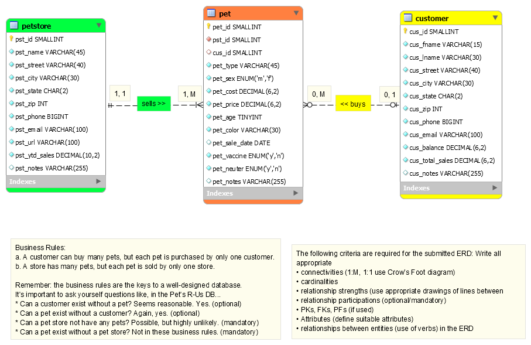

# **LIS4905 Directed Independent Study**

## **Course Resources:**
- [Class Session and Team Meetings](https://us.bbcollab.com/guest/75628214e3f345a4a19cb46fa0dbb42c)
- [Development Resources](resources/README.md "Development Resources")

## **Weekly Requirements:**
[Week1](week1/README.md "Week1") * [Week2](week2/README.md "Week2") * [Week3](week3/README.md "Week3")
* [Week4](week4/README.md "Week4") * [Week5](week5/README.md "Week5") * [Week6](week6/README.md "Week6") 
* [Week7](week7/README.md "Week7") * [Week8](week8/README.md "Week8") * [Week9](week9/README.md "Week9") 
* [Week10](week10/README.md "Week10") * [Week11](week11/README.md "Week11") * [Week12](week12/README.md "Week12")

## **Collaborate Recordings:**
[Week1](https://us.bbcollab.com/recording/801bc84348a84e7589ac2da0794b1588 "Week1") * [Week2](test.htm "Week2") * [Week3](test.htm "Week3")
* [Week4](test.htm "Week4") * [Week5](test.htm "Week5") * [Week6](test.htm "Week6")
* [Week7](test.htm "Week7") * [Week8](test.htm "Week8") * [Week9](test.htm "Week9")
* [Week10](test.htm "Week10") * [Week11](test.htm "Week11") * [Week12](test.htm "Week12")

## **Team members - Summer 21:**

    * [Sebastian Angel-Riano:](sa17d/README.md "Sebastian's repo")
    * [Alexander Boehm:](ab16m/README.md "Alexander's repo")
    * [Philip Bowman:](pmb18c/README.md "Philip's repo")
    * [Justin Davis:](jd19z/README.md "Justin's repo")
    * [Rachel Hester:](rah18b/README.md "Rachel's repo")
    * [Bryan Humphries:](bmh18v/README.md "Bryan's repo")
    * [Mitchell Mujwit:](mm19ch/README.md "Mitchell's repo")
    * [Andrew Vargas:](amv19d/README.md "Andrew's repo")

**Links match subdirectory paths above:**

- [Sebastian Angel-Riano:](sa17d/README.md "Sebastian's repo") sa17d@my.fsu.edu
- [Alexander Boehm:](ab16m/README.md "Alexander's repo") ab16m@my.fsu.edu
- [Philip Bowman:](pmb18c/README.md "Philip's repo") pmb18c@my.fsu.edu
- [Justin Davis:](jd19z/README.md "Justin's repo") jd19z@my.fsu.edu
- [Rachel Hester:](rah18b/README.md "Rachel's repo") rah18b@my.fsu.edu
- [Bryan Humphries:](bmh18v/README.md "Bryan's repo") bmh18v@my.fsu.edu
- [Mitchell Mujwit:](mm19ch/README.md "Mitchell's repo") mm19ch@my.fsu.edu
- [Andrew Vargas:](amv19d/README.md "Andrew's repo") amv19d@my.fsu.edu


## **Course Textbook (Required):**
**Murach's Python Programming (2nd Ed.)**

[](https://www.murach.com/shop/murach-s-python-programming-2nd-edition-detail "Murach's Python Programming - 2nd Ed.")


## **Using Markdown - Links and Images (examples)**:

### Links:

**Generic Syntax:**

```
[Alt text](path/to/img.jpg "Optional title")
```

**Example:** (use no exclamation point)

```
[Pet Store ERD Example](img/pet_store.png "Pet Store ERD example")
```

[Pet Store ERD](./img/pet_store.png "Pet Store ERD")

### Embedded Images:

**Generic Syntax:**

```

```

**Example:** (embedded images require an exclamation mark/point)

```

```

## Pet Store ERD (example)


**Horizontal Rule**:
`---`

---


===================================

## **Preliminary Requirements:**
## 1. **Git Tutorials: (works for both Github and Bitbucket):**

**First: Complete the Following Two Tutorials:**

[Git Tutorial](https://confluence.atlassian.com/bitbucket/git-tutorial-keep-track-of-your-space-station-locations-759857287.html "Working with Git")

[Tutorial: Request to update a teammate's repository](https://confluence.atlassian.com/bitbucket/tutorial-request-to-update-a-teammate-s-repository-774243385.html "Working within a Team Environment")

    a. Set up Git

	b. Create a Bitbucket account and a Git repository

	c. Clone your Git repository and add source files

	d. Create a file and pull changes from Bitbucket

	e. Use Git branches

	f. Create a Bitbucket Team


 * [git - the simple guide](http://rogerdudler.github.io/git-guide/)
 * [Very good overview](http://blogs.atlassian.com/2014/10/git-workflows-saas-teams-webinar-recording/)
 * [Tutorials](https://www.atlassian.com/git/)
 * [Git: Basic Tricks](http://www-cs-students.stanford.edu/~blynn/gitmagic/ch02.html)
 * [Git Basics: Getting a repository](http://git-scm.com/book/en/v2/Git-Basics-Getting-a-Git-Repository)


## **Git - Team Workflow**

**Github Tutorial For Beginners:**

[](https://www.youtube.com/watch?v=0fKg7e37bQE "Github Tutorial For Beginners")

**Branching, Merging & Team Workflow:**

[](https://www.youtube.com/watch?v=oFYyTZwMyAg "GITHUB PULL REQUEST, Branching, Merging & Team Workflow")

- [Resolving Merge Conflicts: ](https://help.github.com/articles/resolving-a-merge-conflict-using-the-command-line/ "Resolving Merge Conflicts")
- [Adopt a Git Branching Strategy: ](https://docs.microsoft.com/en-us/vsts/git/concepts/git-branching-guidance "Adopt a Git Branching Strategy")
- [Pro Git Book V2: ](https://git-scm.com/book/en/v2 "Pro Git Book V2")


## **Markdown Syntax Resources**:
- [x] [http://daringfireball.net/projects/markdown/basics](http://daringfireball.net/projects/markdown/basics)
- [x] [https://confluence.atlassian.com/display/STASH/Markdown+syntax+guide](https://confluence.atlassian.com/display/STASH/Markdown+syntax+guide)
- [x] [https://bitbucket.org/tutorials/markdowndemo](https://bitbucket.org/tutorials/markdowndemo)
- [x] [Markdown Cheatsheet](https://github.com/adam-p/markdown-here/wiki/Markdown-Cheatsheet)


## 2. **Interactive Tutorials:**

The following Web sites and tools can better help you to communicate
code with other people on the Web--they can help you, or you can help
others:

* [Try Git](https://try.github.io/levels/1/challenges/1)
* [jsfiddle.net](http://jsfiddle.net/)
* [pastebin.com](http://pastebin.com/)
* [codepen.io](http://codepen.io/)


## 3. **Markdown Styles:**

*Italics*:

`*italics*`

or...

`_italics_`


**Bold**:

`**bold**`

or...

`__bold__`

***Bold Italics***:

`***bold italics***`

or...

`___bold italics___`


~~Strikethrough~~:	 

`~~Strikethrough~~`


### Adding Code:
Include various code snippets in README.md. Then wrap them in a `code block`.


#### Syntax Highlighting:
[Code Syntax Highlighting](https://github.com/adam-p/markdown-here/wiki/Markdown-Cheatsheet#code "Highlight Code Sytax")


#### Code Blocks:
`` `one line code block` ``

`one line code block`

#### HTML:
```html
<form>
	<input required>
</form>
<script src="jquery.js"></script>
<script src="jquery.validate.js"></script>
<script>
$("form").validate();
</script>
```

#### JavaScript:
```js
var x = 5;
var y = 6;
var z = x + y;
document.getElementById("demo").innerHTML = z;
```

### Adding Youtube videos:

```
[](http://www.youtube.com/watch?v=YOUTUBE_VIDEO_ID_HERE "link title")
```

**Example:**
[](https://www.youtube.com/watch?v=n4nQKRIteGE "Top 10 Muscle Cars")


**Another:**
[](https://www.youtube.com/watch?v=mymewEQiQhY "FK BRNO")


## 4. **Documentation:**


## Official website

* [https://bitbucket.org/mjowett/lis4905_sum21/](https://bitbucket.org/mjowett/lis4905_sum21/)


You also can run the ```demo```:


* Clone repo (when content becomes available):

```
git clone git@bitbucket.org:mjowett/lis4905_sum21.git
```

* Access demo (on **your** computer):

```
http://localhost/path_to_repos/lis4905_sum21
```

## Contribution

Contributions are welcome **and** mandatory!  :)

## License

For more information about the license, see http://example.com/license/

Copyright (c) 2021 **lis4905_sum21**

Licensed under the **Git 'R Dun** license.
