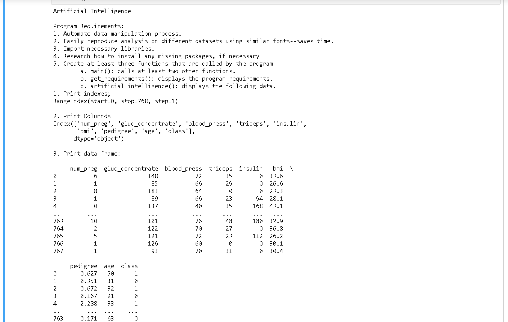
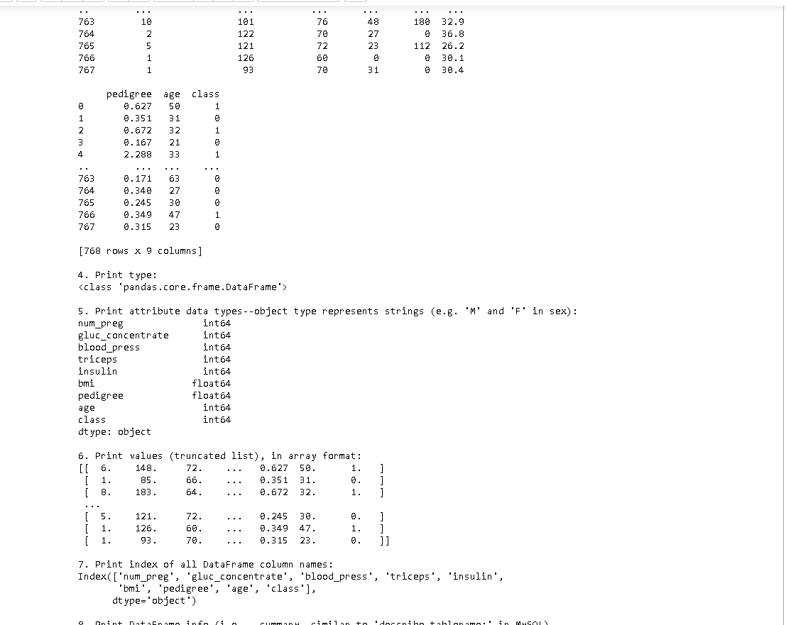
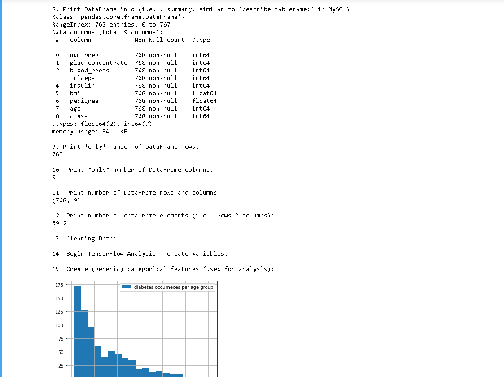
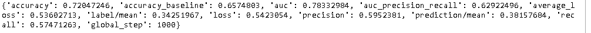

# Welcome to my a5 Artificially Intelligent ReadMe

## Some images of Jupyter Notebook

| part 1 | part 2 | part 3 |
| --- | --- | --- |
|||

## Results

 
 

## General Questions:

#### What is AI in your words?
    AI, or Artifical Intelligence, in a broad sense refers to a program which mimics intelligence in some way.
    Usually it does this through a learning process, altough in the broadest sense an AI doesn't need to be a 
    learning program, just one that can make choices. The earliest AI would be described as programs that can
    rival humans in games such as chess. Or by Alan Turing's definition, an AI would be something that would
    be indistinguishable from a human when communicated with over text messages.

#### What is machine language?
    Machine language is one level of abstraction deeper than assembly, as close to the hardware as you can get.
    That is to say humans are, generally speaking, unable to read and write any length of program with it.
    Machine language is OS dependent, and is the very root level of instructions completed by computer hardware.
    It can be understood as instructions written in binary, the native form of data on a computer.

#### What is deep learning? What is a neural network?
    Elon Musk, one of the creators of the neuralink project, would describe a neural network as being
    a technology which is meant to model our own neural network, which is of course our brain. My understanding
    of it is a vast collection of modular individual thinking components which work together to mimic the overall
    process of learning. Musk noted that the neural network is to the brain as the submarine is to the fish. I
    think this is a good way to understand it, as it should be understood to be distinctly different from an
    organic brain, even though it does borrow the same principles of learning. The 
    thing that is really impressive that we have seen so far from deep learning is the abillity to take a set of
    input, and to extrapolate a rule set for what qaulifies as being similar to that input. We don't have to tell
    the computer what these rules are, it is capable of creating them based off the input alone. It can then both
    recognize these patterns and apply them to other things, even unrelated things.

#### [deep learning](https://www.youtube.com/watch?v=X0oSKFUnEXc "Robot Brain") 

#### What is natural language processing?
    Natural language processing is the ability to examine speech or text and understand the contents. We often
    see natural language processing AI in our voice command technology today. However, natural language
    processing applies to text as well. The ability for a computer to examine a text and understand the contents
    and meaning of the documents is another important aspect of this process, especially for doctors and scientist
    who need to quickly scan through journals for important information.

## TensorFlow and PyTorch Questions:

#### What are TensorFlow and PyTorch used for?
    TensorFlow is a neaural network program used mostly for creating predictive models, however it is capable of
        completing many mathmatical deep learning tasks. It's name comes from tensor, a type of dataset it was built
        to manipulate. PyTorch is a machine learning library based on the Torch library and built for Py. Some of its
        best uses are for computer vision and language processing. Ultimately both libraries work with similar datasets
        and perform similiar tasks. The user/developer should choose to implement whichever works better for them.
    TensorFlow:
        developed by google
        widly adopted and supported
        well documented
    PyTorch:
        better suited to python
        newer framework

#### Any documented issues?
    I did notice some errors relating to the versions of different tools included in the TensorFlow library. Ultimately
    after making sure I had the write dependencies, and versions, installed I was able to run the program. Although, I 
    did receive some warning messages, I was able to successfully execute the program in my runtime environment.

#### Link to my notebook
[Jupyter Notebook](ai_a5.ipynb "Jupyter Notebook")

#### Here's to long nights
:sleeping::sleeping::sleeping::sleeping::sleeping::sleeping::sleeping::sleeping::sleeping::sleeping::sleeping::sleeping::sleeping::sleeping: 

        

        
