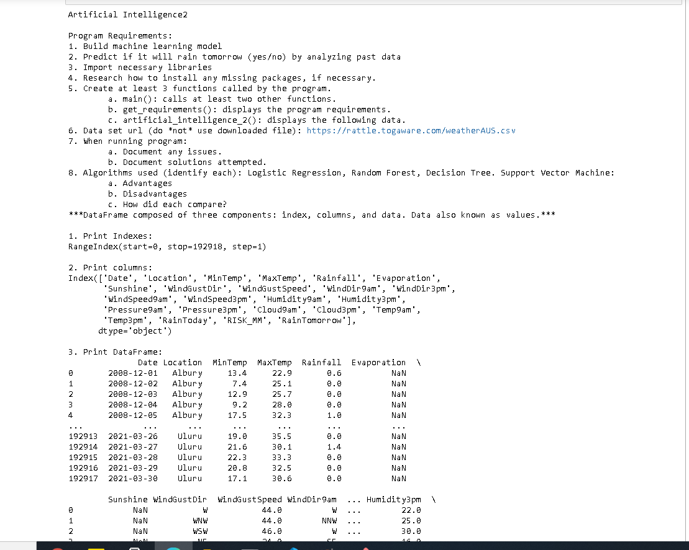
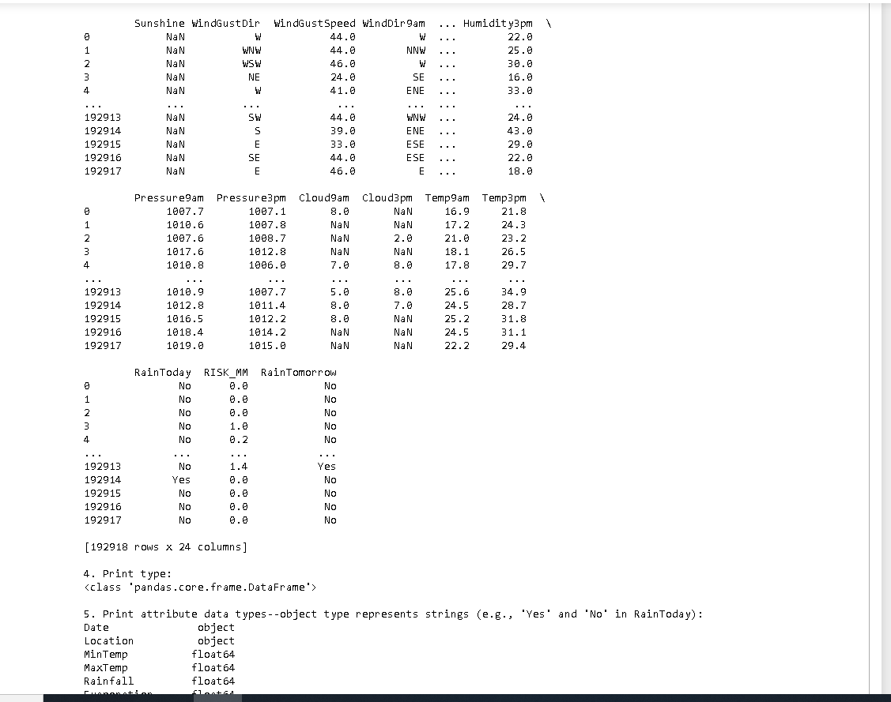
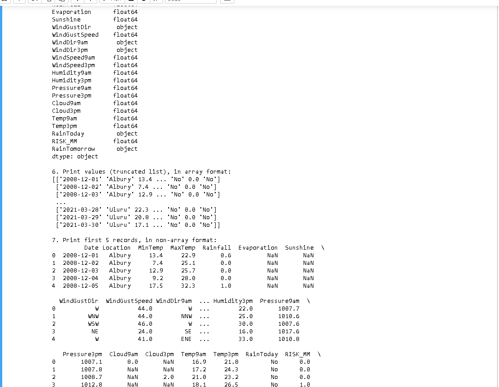
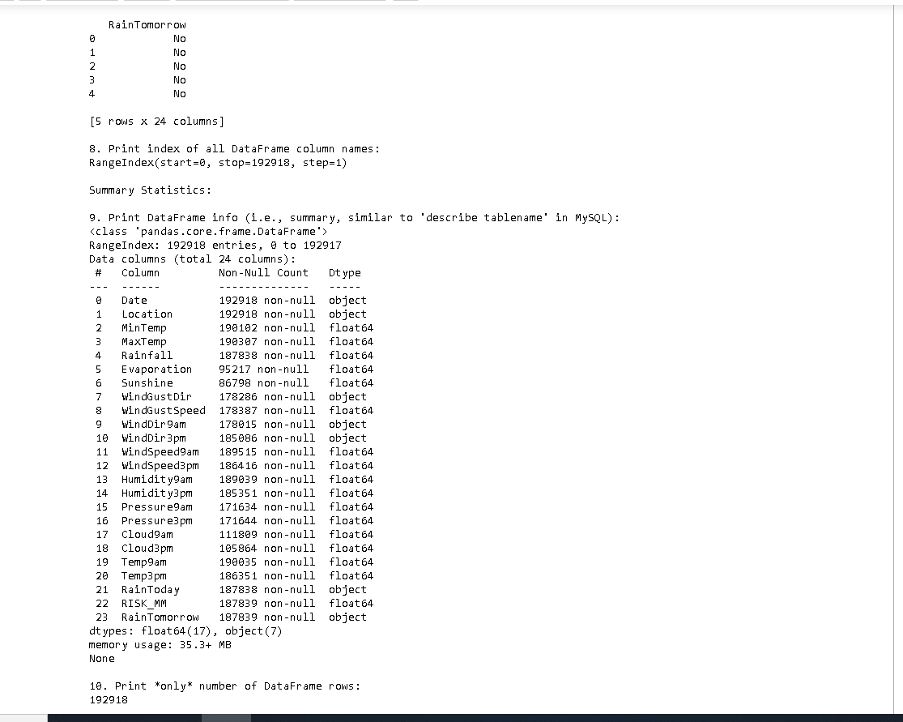
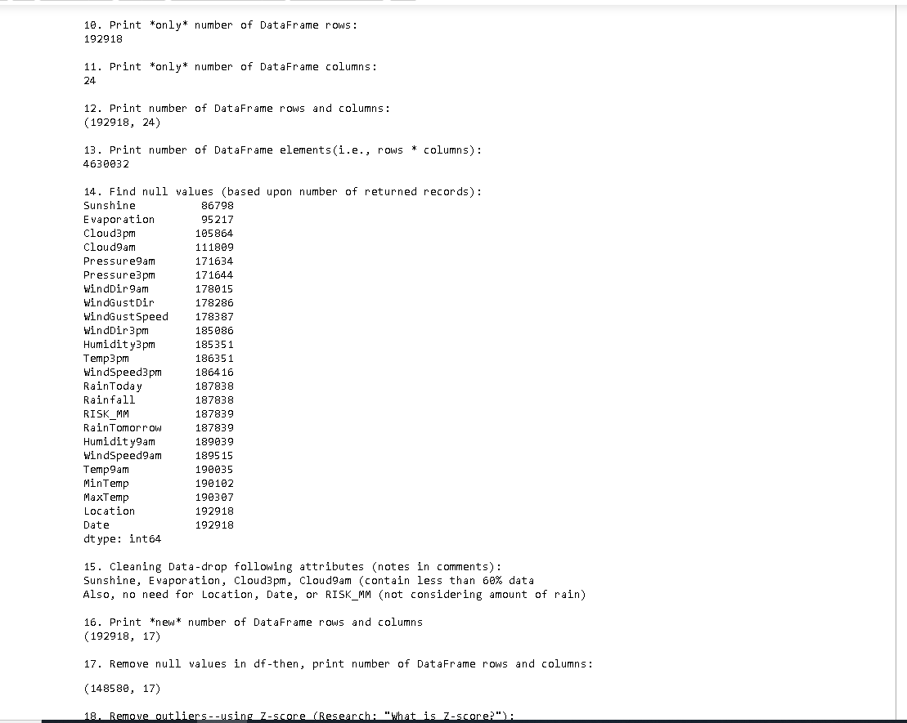
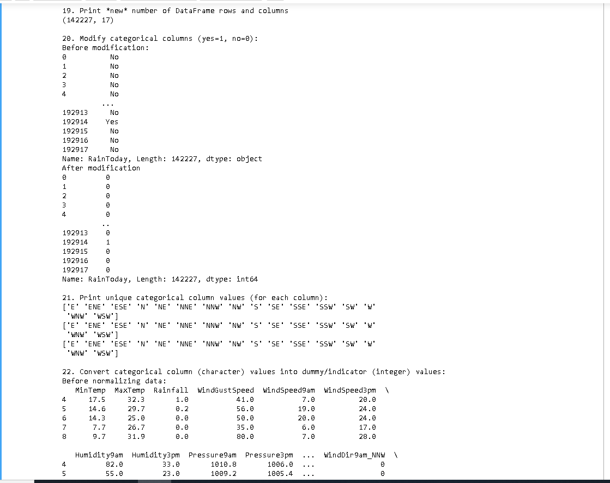
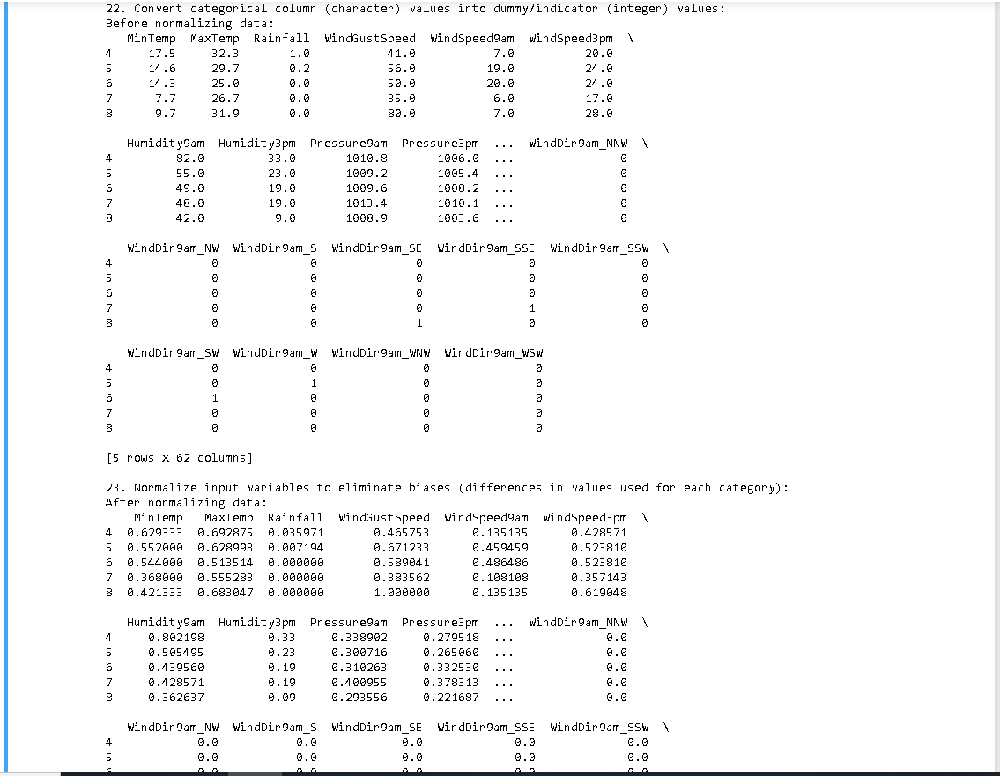
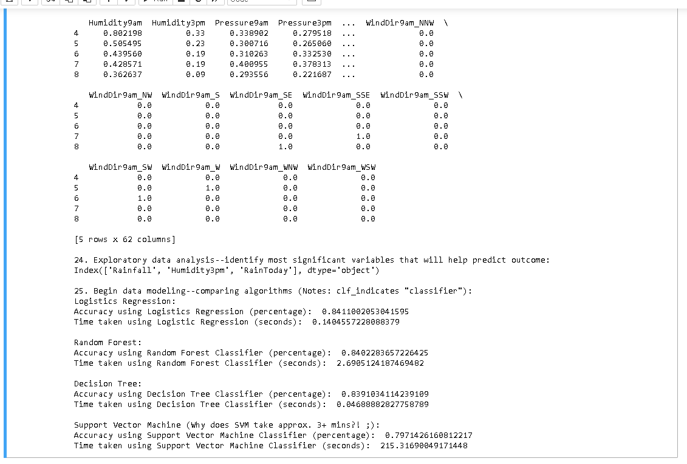

# Welcome to my a5 Artificially Intelligent ReadMe

## Some images of Jupyter Notebook

| part 1 | part 2 | part 3 |
| --- | --- | --- |
|||

### Continued...
| part 4 | part 5 | part 6 |
| --- | --- | --- |
|||

### Continued Again...
| part 7 | part 8 |
| --- | --- |
||

## Identify The Algorithms used:

#### Logistic Regression

    A. Advantages
        Works with binary data sets, yes or no values, and maps them to work with and represent nominal value.
    B. Disadvatages
        In order to find the results of this type of operation, you must begin with a data set without outiers.

#### Random Forest

    A. Advantages
        A random forest is a collection of decision trees. Using a collection of these trees tends to resolve to a better
        predicitve learning model, as output from a decision tree is often too tightly linked to the training data. Using a 
        forest allows for a better overall spread of results to model acutal probability.
    B. Disadvatages
        They are harder to interpret than singular decision trees, and interpretability is one of the better reasons to use tree models
        in the first place.

#### Decision Tree

    A. Advantages
        A decision tree is a model for predicting an outcome about an item based upon multiple variable inputs about that item.
        It is essentially a model that works based upon using condintional statements to predict outcomes.
        Decision trees where the target variable can take continuous values(typically numerical) are called regression trees.
    B. Disadvatages
        The main disadvantage of a decision tree is that they tend to overfit data to their training set. This makes sense considering
        the construction of the model is based off many branching conditional statements.

#### Support Vector Machine

    A. Advantages
        By definition, a Support Vector Machine is a non-probabilistic binary linear classifier. It works by taking a binary result set, and then
        developing a model by which it can use to assign new elements to one of the two categories. More specifically it works by mapping training examples
        to points in space to maximise the width of thje gap between the two result sets. Then it maps new inputs items as falling somewhere on either side
        of this gap. There are many tricks one can use with this base technology to complete different deep learning tasks.
    B. Disadvatages
        Apart from apparently taking more time than any of the other methods and being the least accurate for this use case, it is also not inherently built to
        work with or generate probabilistic result sets. It is also primarily meant to work with linear results. Although both of these issues have workarounds that
        allow this algorithm to complete both of these tasks respectively.

#### Link to the files

[This is Python](ai_two.py "Python File")
[This is Jupyter NB Python](ai_assignment2.ipynb "IPYNB File")

#### Here's to SCIENCE!

The :cake: is a lie    
:cake::knife::cake::knife::cake::knife::cake::knife::cake::knife::cake::knife::cake::knife::cake::knife:    
