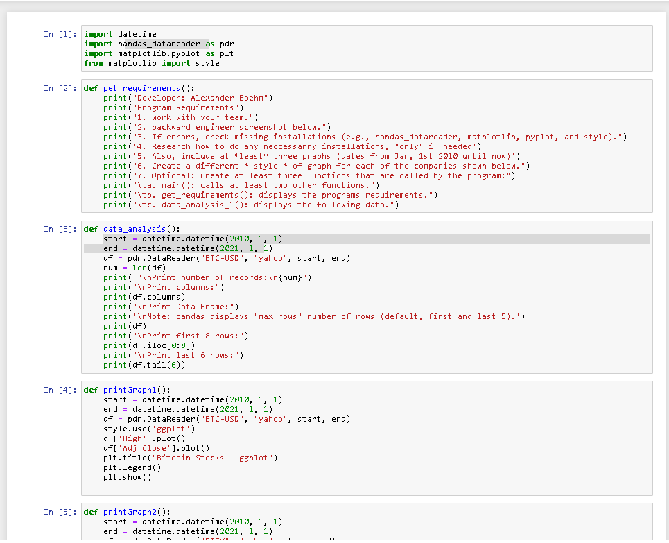

## Greetings and Welcome to...   
<h3> My Graphmatical readme!
Here are some images! <h3>

#### JupyterNotebook Screenshots 

| Part 1 | part 2 |
| --- | --- |
| | |

#### JupyterNotebook Screenshots Continued

| Part 3 | part 4 | part 5 |
| --- | --- | --- |
| | |  |

| part 6 | part 7 | part 8 |
| --- | --- | --- |
| | | |

#### Anaconda Notebook Link
[Jupyter Notebook Link](dis_a3.ipynb "Graphmatical" )

#### For the love of the humans
:heart_eyes_cat::heart_eyes_cat::heart_eyes_cat::heart_eyes_cat::heart_eyes_cat::heart_eyes_cat::heart_eyes_cat::heart_eyes_cat::heart_eyes_cat::heart_eyes_cat::heart_eyes_cat::heart_eyes_cat::heart_eyes_cat::heart_eyes_cat::heart_eyes_cat: 

