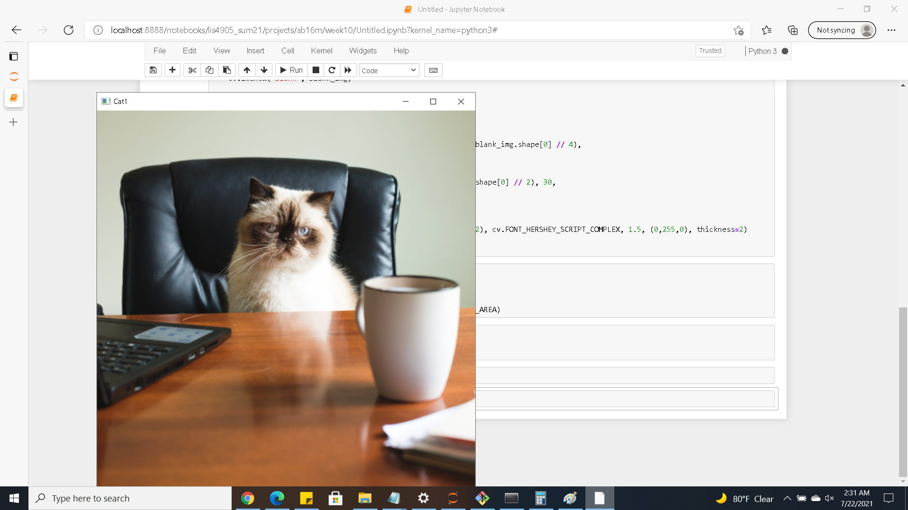
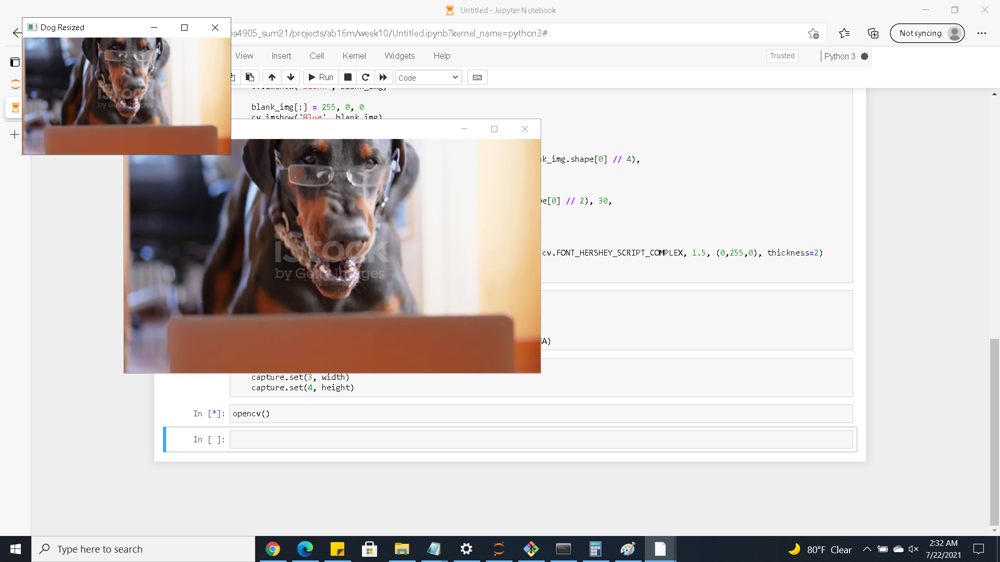
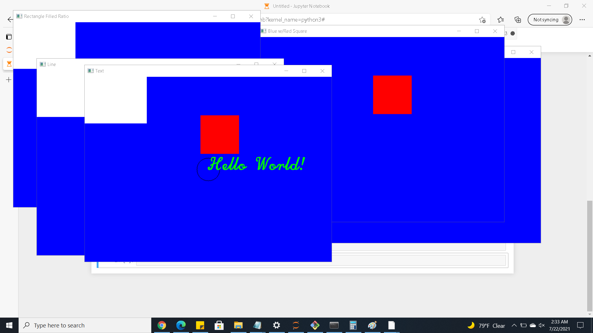

# Welcome once again to my README :)

#### Here are some images of my assignement

| Part1 | Part2 | Part3 |
| --- | --- | --- |
|  |  |   | 

#### Link to my ipynb file
[Jupyter Notebook](comp_vision.ipynb "Jupyter Notebook")

#### Late Nights
:new_moon::waxing_crescent_moon::first_quarter_moon::waxing_gibbous_moon::full_moon::waning_gibbous_moon::last_quarter_moon::waning_crescent_moon:
:new_moon::waxing_crescent_moon::first_quarter_moon::waxing_gibbous_moon::full_moon::waning_gibbous_moon::last_quarter_moon::waning_crescent_moon:
:new_moon::waxing_crescent_moon::first_quarter_moon::waxing_gibbous_moon::full_moon::waning_gibbous_moon::last_quarter_moon::waning_crescent_moon:   

