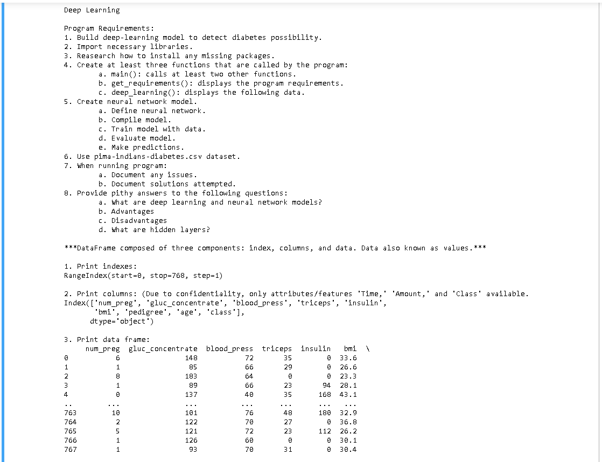
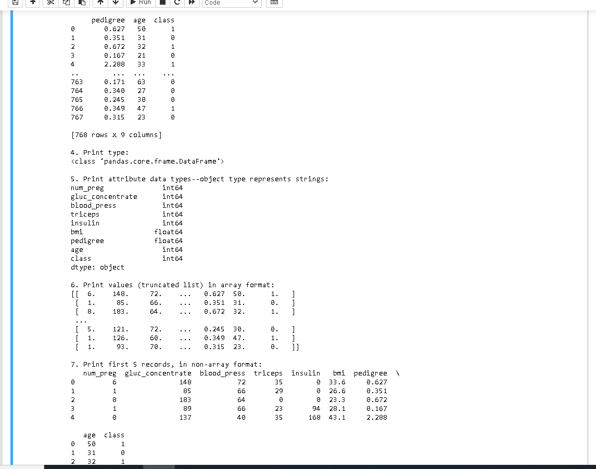
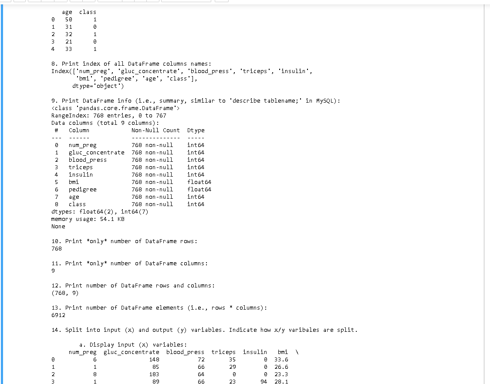
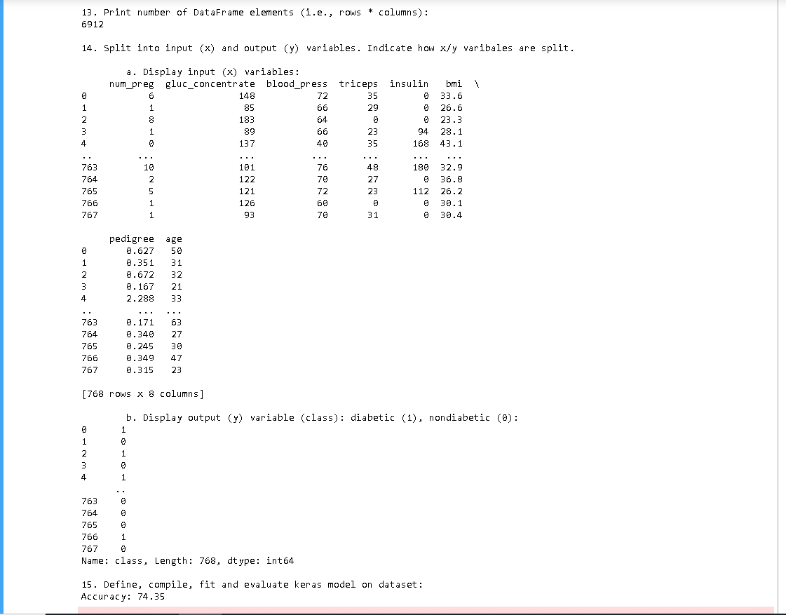
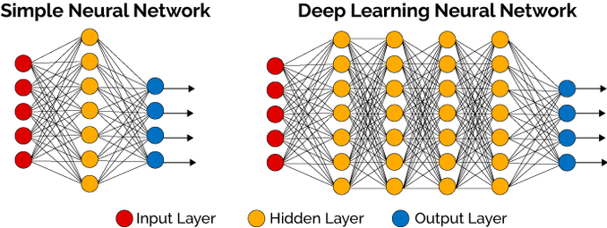

# Welcome once again to my README :)

#### Here are some images of my assignement

| Part1 | Part2 | Part3 | Part4 |
| --- | --- | --- | --- |
|  |  |   |   |

## Here are some Short Responses

#### What are deep learning and neural network models?
    Deep learning is a model of machine learning based off of neural networks.
    Learning can be supervised(based off human input), semi-supervised(somewhere in the middle), or unsupervised(independent of human input)
    Artificial neural networks were inspired by information processing and distributed communication nodes in biological systems
    Deep neural networks are esentially the combination of several ANN's layers between the input and output layers
https://en.wikipedia.org/wiki/Deep_learning

#### Advantages & Disadvantages
    Roughly speaking, artificial neural networks can be designed with many different architectures and alorithms in use. Therefore, trying to
    create a comprehensive pros and cons list that applies across the board to this model of machine learning would be difficult.
    What I will say is this. Machine intelligence is inherently different than human intelligence. Although neural networks are roughly modled after
    organic intelligence systems(Neurons and Synapses) they are inherently mechanical and will not always behave as expected.

#### What are hidden layers?
    Essentially hidden layers are where the nerual network or the deep neural network turns inputs into outputs, applying weight to the inputs and directing
    them through an activation function as the output. They perform nonlinear transformations of the inputs entered into the network. Here's a visual representation.

:fireworks::beers::star::beers::fireworks::beers::star::beers::fireworks::beers::star::beers::fireworks::beers::star::beers:    

