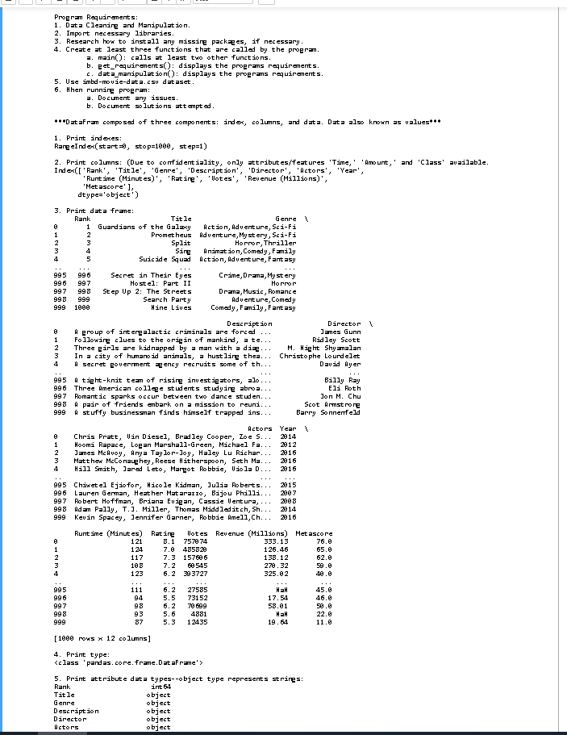
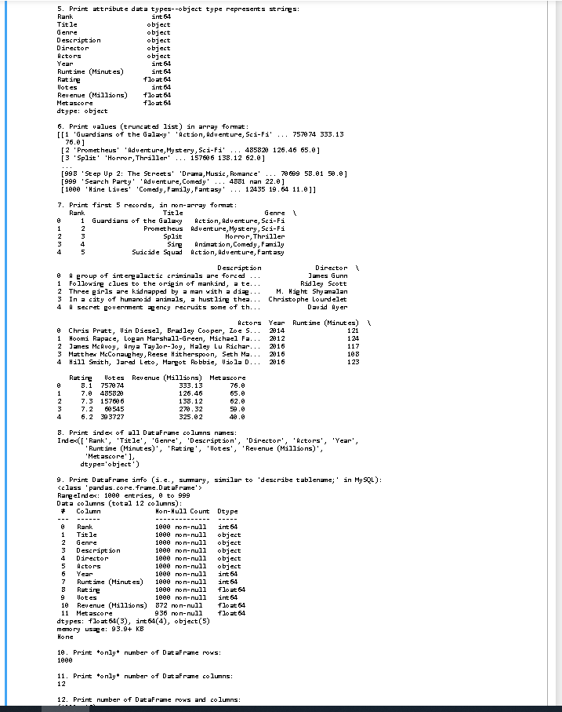
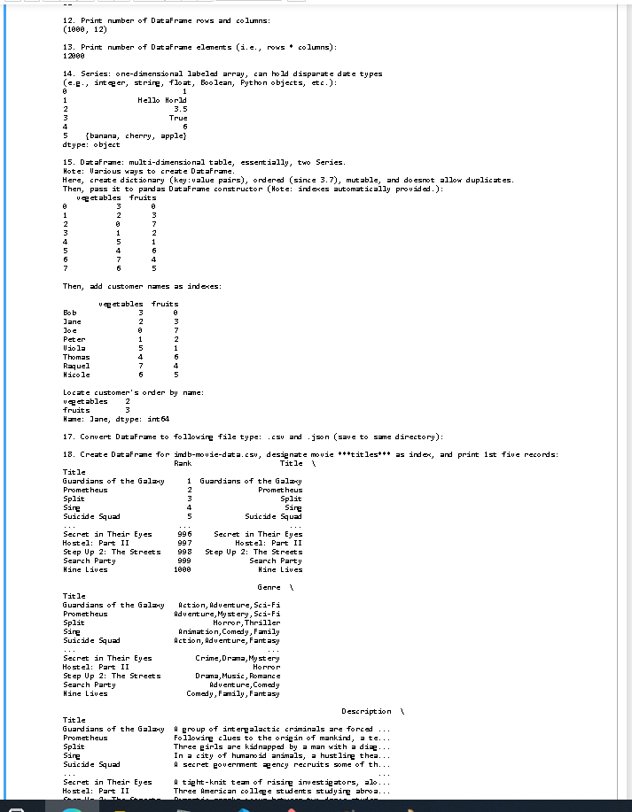
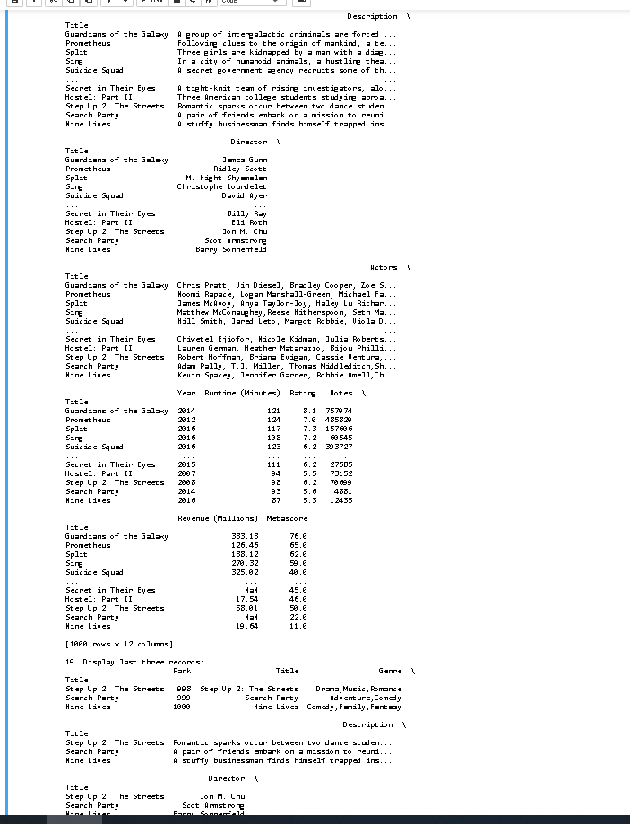
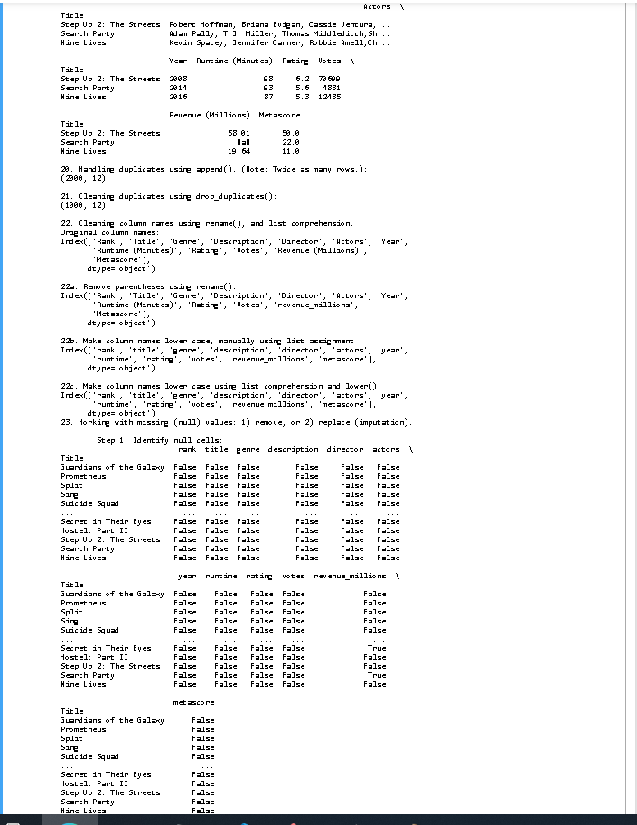
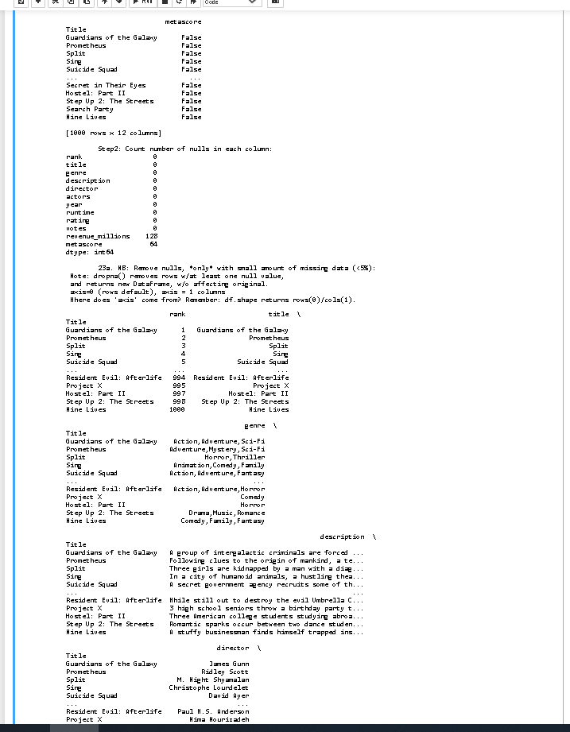
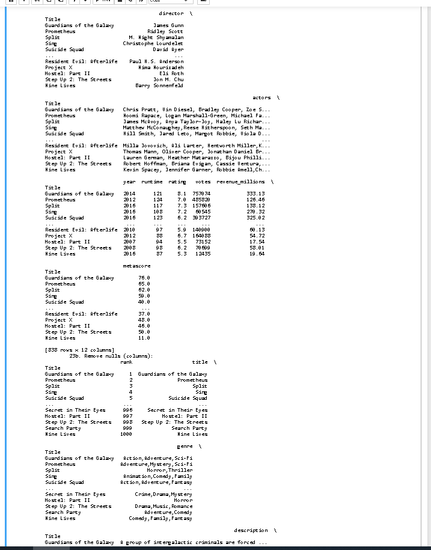
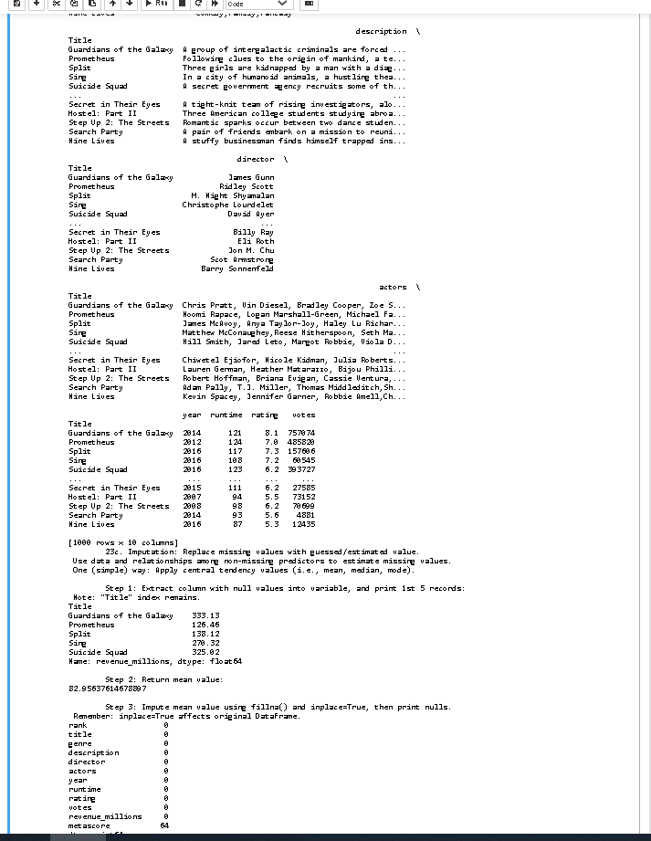
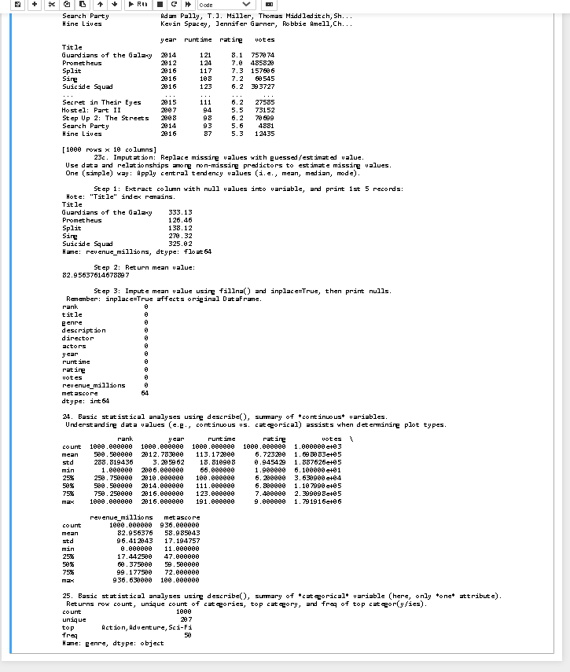

# Welcome once again to my README :)

#### Here are some images of my assignement

| Part1 | Part2 | Part3 | Part4 |
| --- | --- | --- | --- |
|  |  |   |   |

#### continued
| Part5 | Part6 | Part7 | Part8 |
| --- | --- | --- | --- |
|  |  |   |   |
|  |

#### Link to my ipynb file
[Jupyter Notebook](data_manipulation.ipynb "Jupyter Notebook")

#### I got ghosted this week T.T
:bird::bee::ghost::bird::bee::ghost::bird::bee::ghost::bird::bee::ghost::bird::bee::ghost::bird::bee::ghost:    

