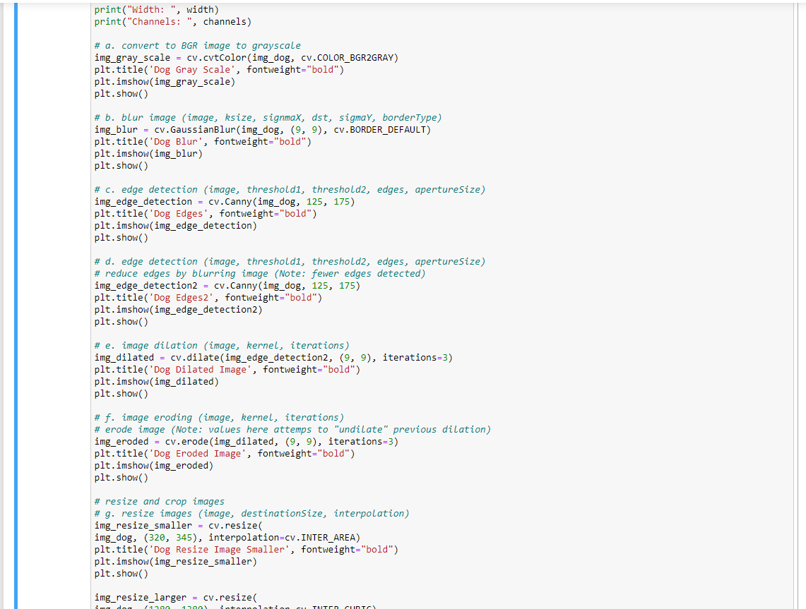
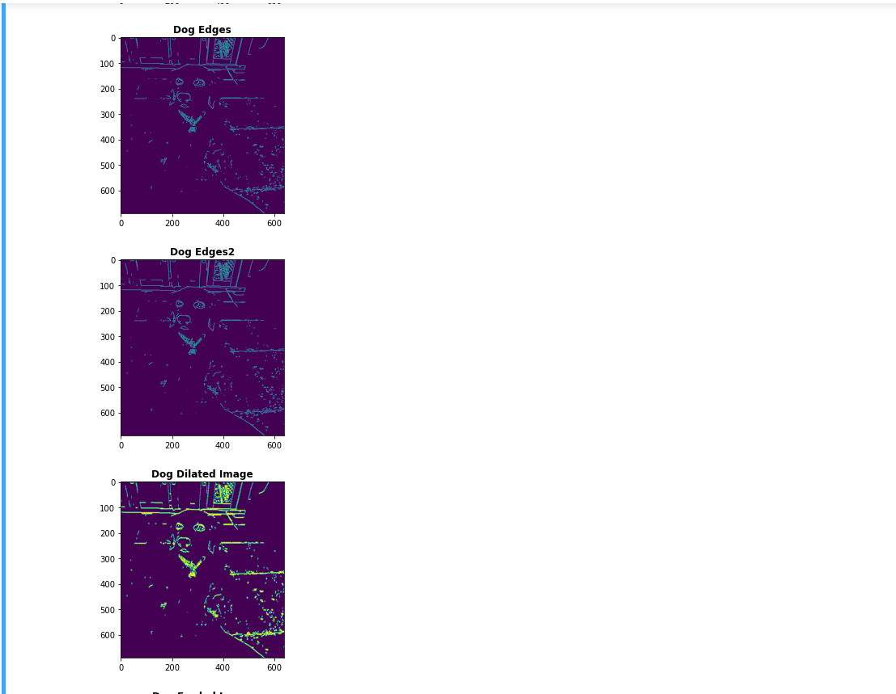

***WEEK 11 README***

1. *Create a Python program based upon the following requirements:*
    1. Use *all* four intrinsic Python Data Structures: *List*, *Tuple*, *Set*, *Dictionary*.
    2. Randomly assign grades of *"S"* or *"U"* (satisfactory or unsatisfactory) to each DIS member.
    3. Display code *and* results to *your* Bitbucket repo.

1. *Backward-engineer screenshot below:* README.md file should include the following items:
    1. *Screenshot of your Jupyter notebook (see below);*
    2. Upload .ipynb file and create link in README.md;
        *NOTE:* Before uploading .ipynb file, be sure to do the following actions from *Kernal* menu:
            a. *Restart & Clear Output*
            b. *Restart & Run All*
    *Note: Always* run the .py files before trying t ocreate a Jupyter notebook using the code from the .py files. If the .py files won't run, neither will the notebook

***WEEK 11 README***

    

    

    

    

    

    

 

    

    

    

    

 

 

1. Link to Notebook
[Notebook](documents/DISweek11.ipynb "Week 11 notebook")

[Notebook](documents/DISweek11part2.ipynb "Week 11 notebook")