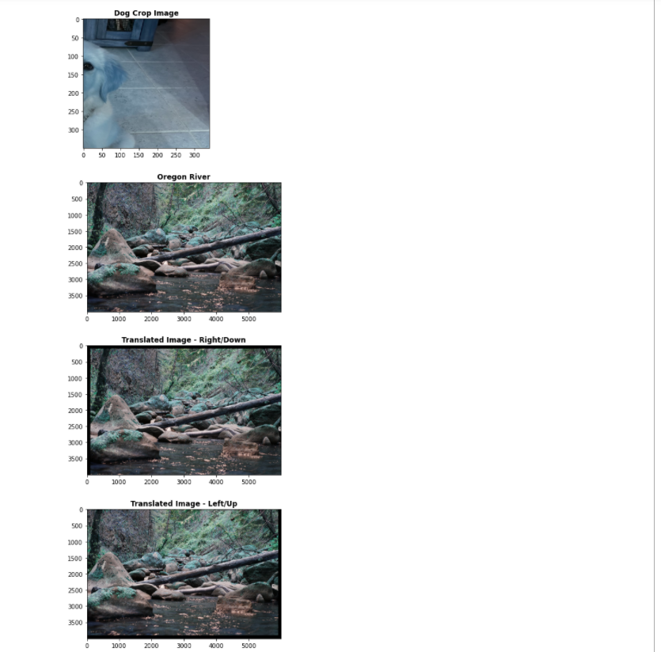

# LIS4905

## Bryan Humphries

### Week 11 Requirements:

1. *Backward-engineer screenshot below:* README.md file should include the following items:
    1. *Screenshot of your Jupyter notebook (see below);*
    2. Upload .ipynb file and create link in README.md;
        *NOTE:* Before uploading .ipynb file, be sure to do the following actions from *Kernal* menu:
            a. *Restart & Clear Output*
            b. *Restart & Run All*
    *Note: Always* run the .py files before trying t ocreate a Jupyter notebook using the code from the .py files. If the .py files won't run, neither will the notebook!

#### Assignment Links:

*.ipynb File for Grading Program*

[ipynb File](docs/gradeScores.ipynb)

*Grading Program Python Code*

[Grading CS Code File](docs/gradeScoresFile.py)

*.ipynb OpenCV2 Program*

[ipynb File](docs/imgFun.ipynb)

*OpenCV2 Python Code*

[OpenCV2 Code](docs/openCV2.py)

#### Assignment Screenshots:

*Week 11 Screenshots*:

