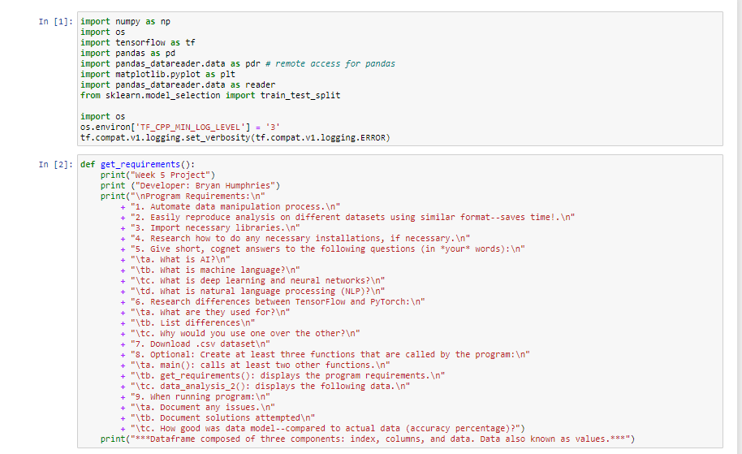
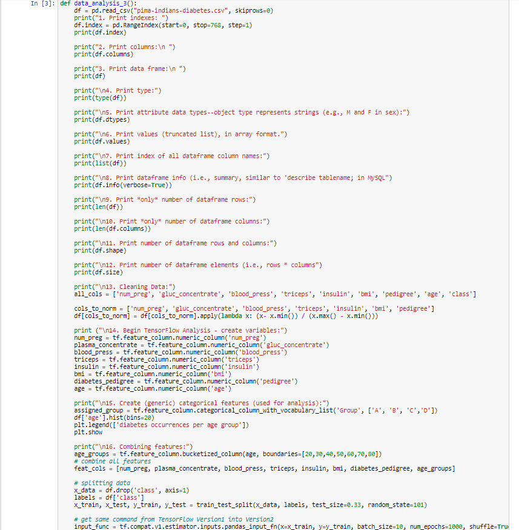
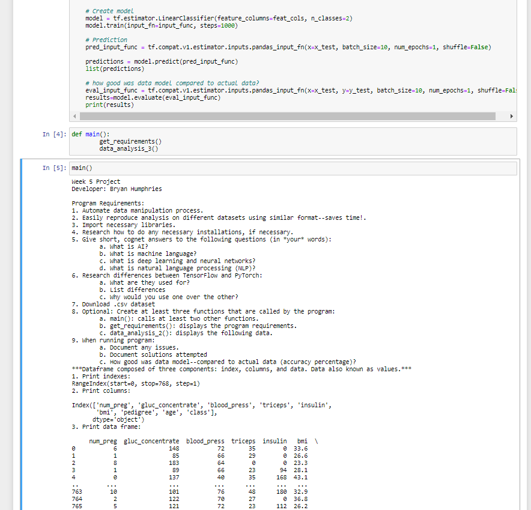
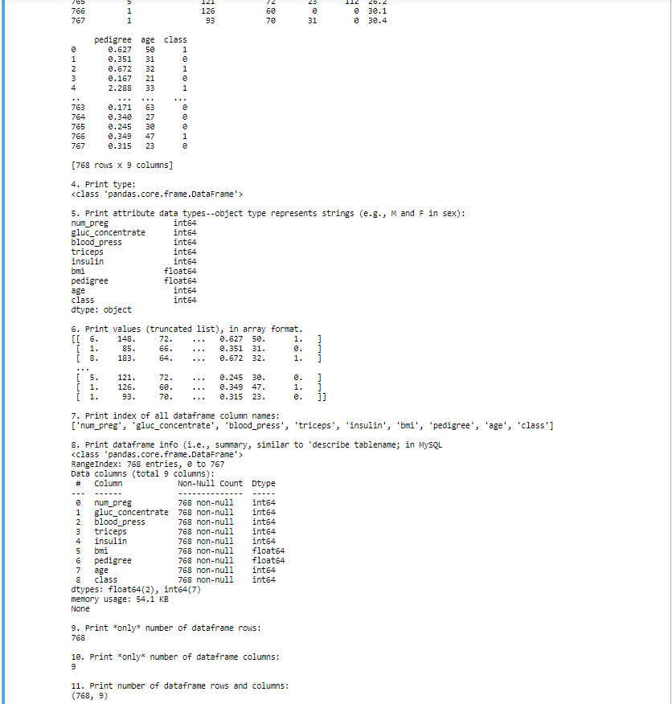
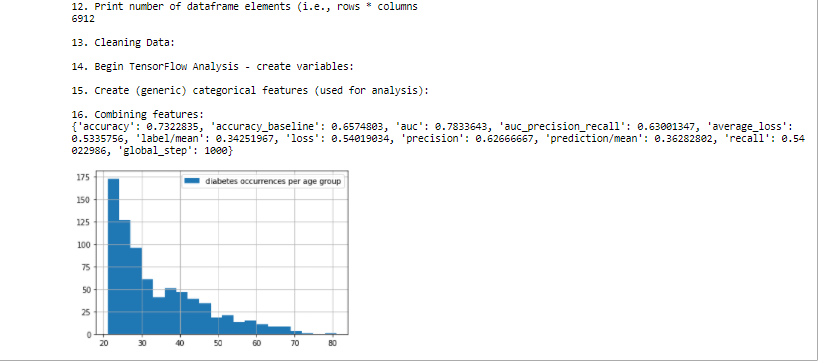

# LIS4905

## Bryan Humphries

### Week 5 Requirements:

1. *Chs. 16-18 in Python textbook.*
2. *Backward-engineer screenshot below:* README.md file should include the following items:
    1. *Screenshot of your Jupyter notebook (see below);*
    2. Upload .ipynb file and create link in README.md;
        *NOTE:* Before uploading .ipynb file, be sure to do the following actions from *Kernal* menu:
            a. *Restart & Clear Output*
            b. *Restart & Run All*
    *Note: Always* run the .py files before trying t ocreate a Jupyter notebook using the code from the .py files. If the .py files won't run, neither will the notebook!

#### Assignment Links:

*.ipynb File*

[ipynb File](docs/ai_jupyter.ipynb)

*AI Code*:

[ai File](docs/functions_AI.py)

#### Assignment Questions:
5. Give short, cogent answers to the following questions (in *your* words):
    - What is AI?
        - AI is intelligence demonstrated by machines unlike natural intelligence by humans and animals.
    - What is machine learning?
        - Machine learning is the study of computer algorithms that improve by experience and constant use of data.
    - What is deep learning and neural networks?
        - Neural network is an aritficial network composed of neurons or nodes. Deep learning is learning methods based on artificial neural networks.
    - What is natural language processing (NLP)?
        - NLP is the automatic replication of natural language like speech and text.
6. Research difference between TensorFlow and PyTorch:
    - What are they used for?
        - Both of these are used in deep learning methods.
    - List differences.
        - Pytorch is more of a pythonic framework and TensorFlow is more of a new language.
        - Pytorch has a more object-oriented approach.
        - Different kinds of graphs and visuals.
    - Why would you use one over the other?
        - I would pick TensorFlow because of the ease of use and it gives many options when it comes to the programming approach.
9. When runing program:
    - Document any issues.
        - The installations of TensorFlow and Pytorch.
    - Document solutions attempted.
        - Conda install version
        - Did an install for TF and Pytorch in conda
    - How good was data model--compared to actual data (accuracy percentage)? 
        - The accuracy of the data was 0.7322835%.

#### Assignment Screenshots:

*Week 5 Screenshots*:

