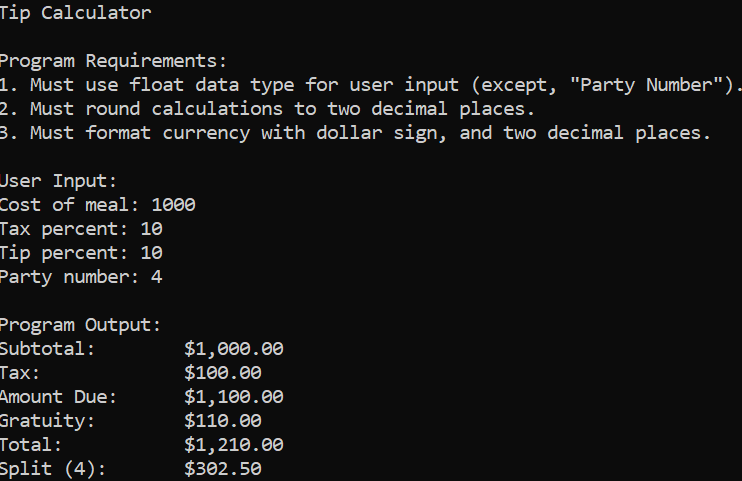
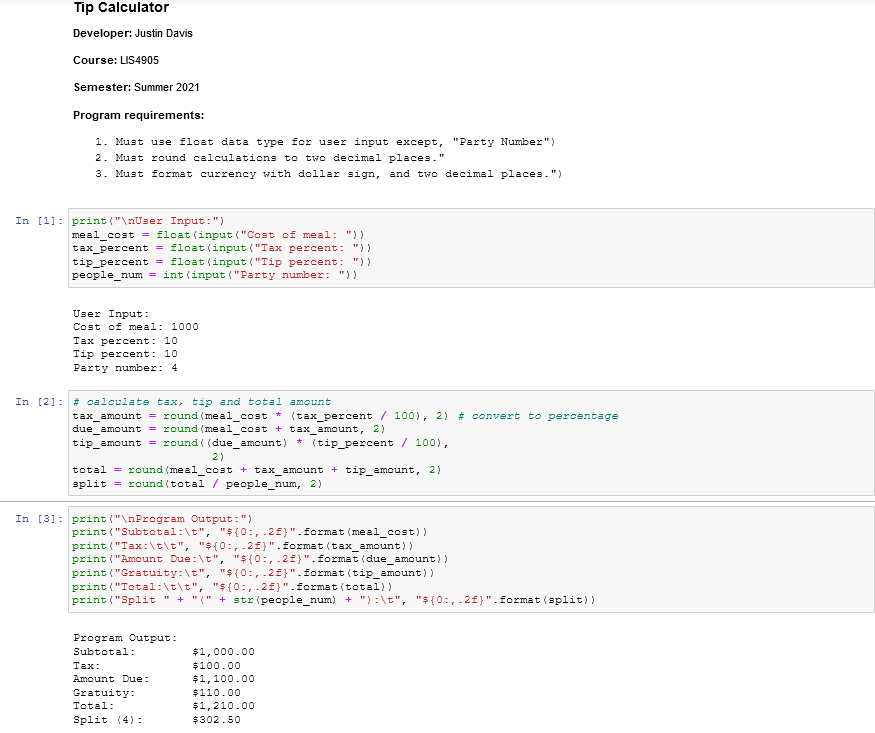

# LIS4905

## Justin Davis

### Week 2 Requirements:

1. Team Work: One File
2. Distributed Version Control (*only* if Git not installed)
3. Development Installations
4. *Test Installation*

#### Assignment Links:

*.ipynb File*

[tip_ipynb File](docs/tip_calculator.ipynb)

*Tip Calculator Code*:

[tip_py File](docs/a1_tip_calculator.py)

#### Assignment Screenshots:

*Week 2 Screenshots*:

