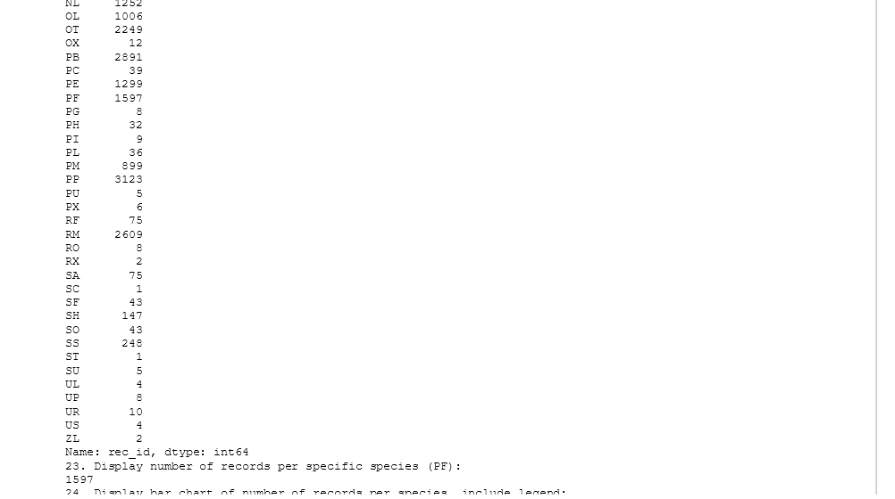

# LIS4905

## Justin Davis

### Week 4 Requirements:

1. *Backward-engineer screenshot below:* README.md file should include the following items:
    1. *Screenshot of your Jupyter notebook (see below);*
    2. Upload .ipynb file and create link in README.md;
        *NOTE:* Before uploading .ipynb file, be sure to do the following actions from *Kernal* menu:
            a. *Restart & Clear Output*
            b. *Restart & Run All*
    *Note: Always* run the .py files before trying t ocreate a Jupyter notebook using the code from the .py files. If the .py files won't run, neither will the notebook!

#### Assignment Links:

*.ipynb File*

[animal_survey Ipynb](docs/animal_survey.ipynb)

*Graphing Stocks Code*:

[animal_survey File](docs/animal_survey.py)

#### Assignment Screenshots:

*Week 4 Screenshots*:

