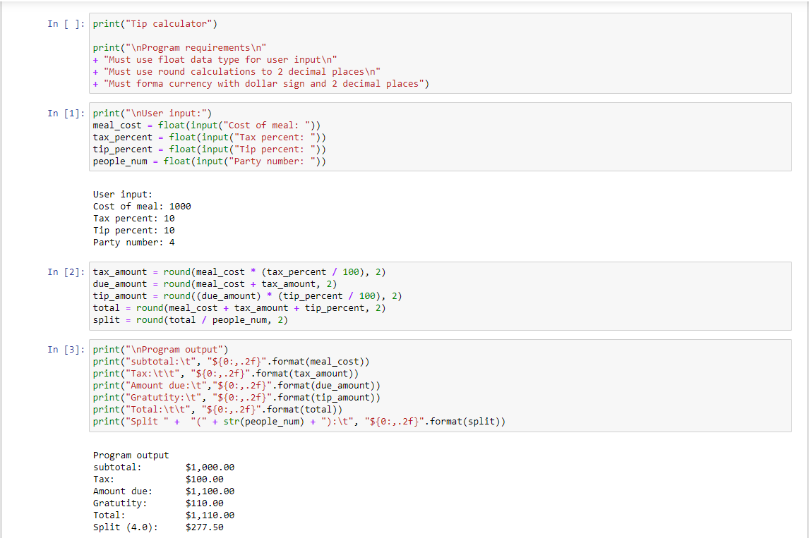
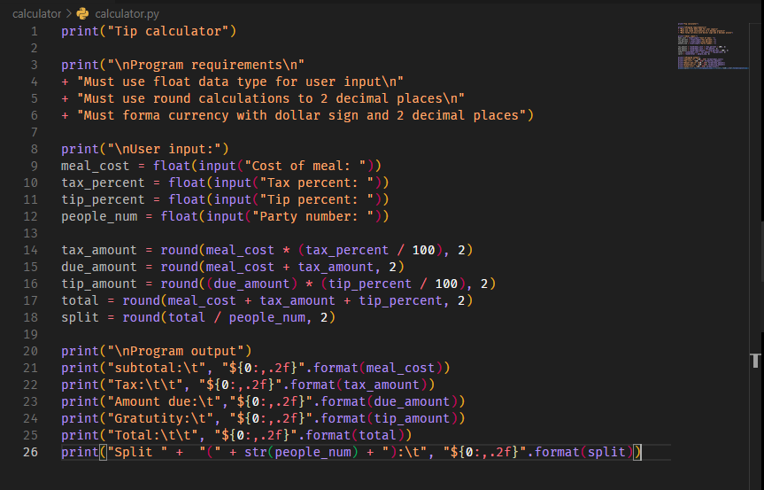
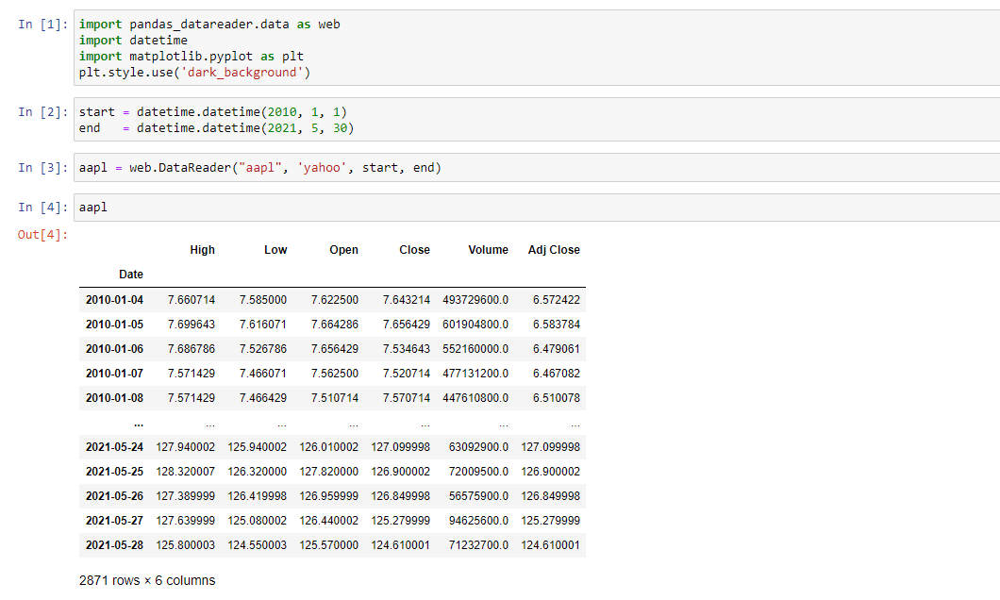
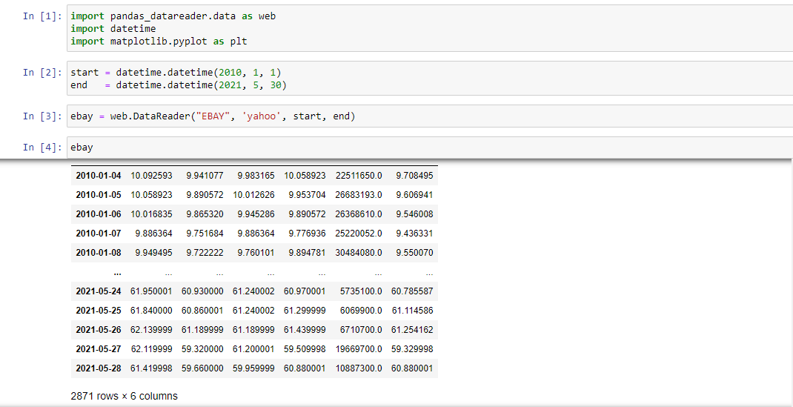
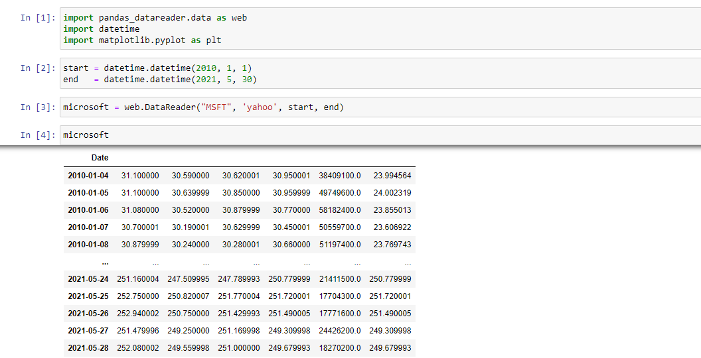
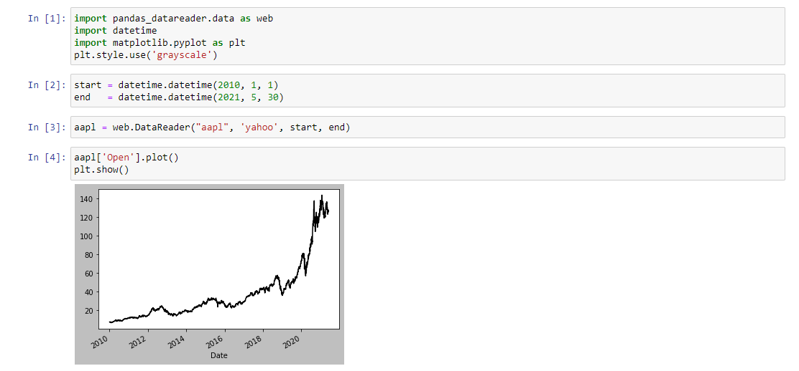
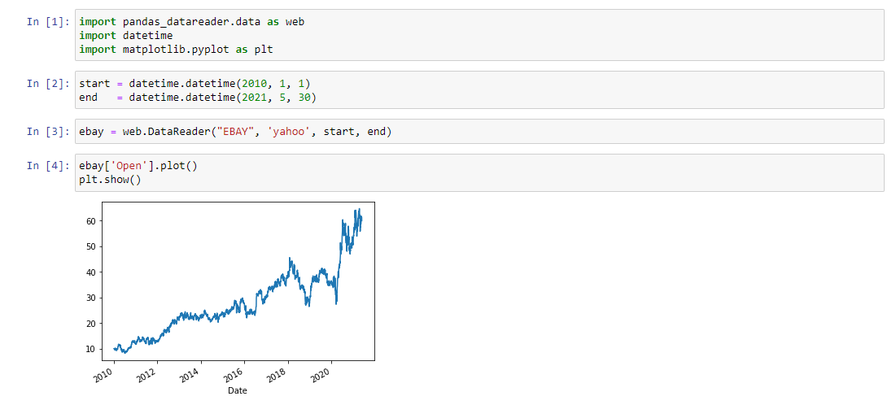
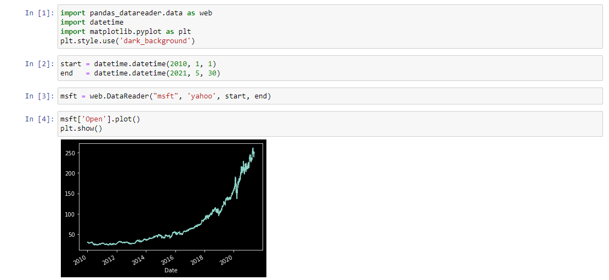
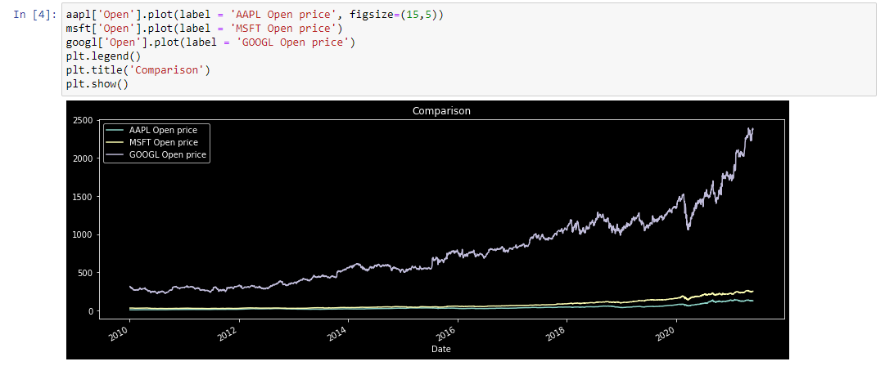

# Mitchell Mujwit Project Directory

*Log your name and time*
 -------------------------------- 

1. Rachel Hester, 7:50PM on 5/16/21  
2. Phil Bomwan, 8:23pm on 5/16/21  
3. Justin Davis, 12:14PM on 5/17/21  
4. Sebastian Angel-Riano 5/17/21  
5. Alexander Boehm 12:47AM on 5/19/21  
6. Bryan Humphries 11:39 AM 5/20/21  
7. Andrew Vargas 12:11PM 5/20/21  

# A1:

| Calculattor in jupyter                | Calculator in vscode     |
|---------------------------------------|--------------------------|
|  |  |

[Jupyter file](calculator.ipynp)

# A2:

### Data

| AAPL                  | EBAY                  | MSFT                  |
|-----------------------|-----------------------|-----------------------|
|  |  |  |

### Charts

| AAPL Plot                  | EBAY Plot                 | MSFT Plot                |
|-----------------------|-----------------------|-----------------------|
|  |  |  |

### Comparison of charts

[Jupyter file](stocks.ipynp)