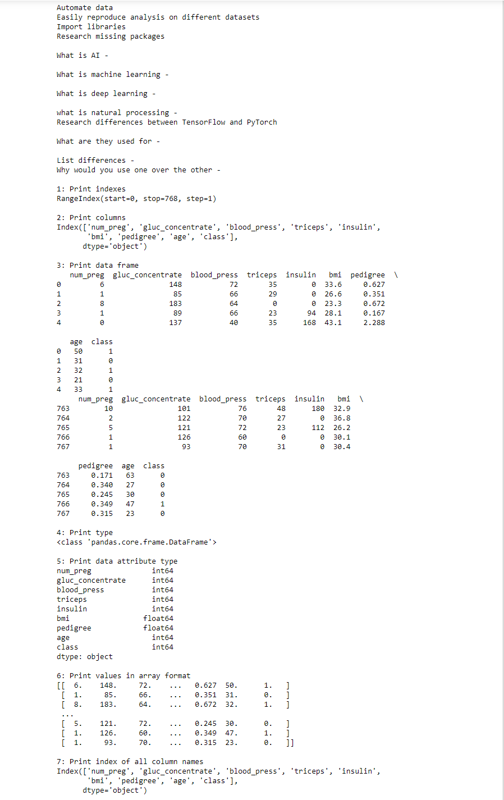
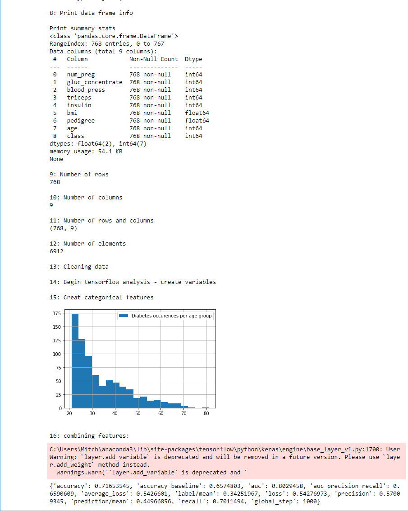

# Week 5:

### Questions:

1. What is AI - AI is intelligence for machines, AI is meant to mimic human intelligence inside of a computer.
2. What is machine learning - Machine learning is the use of algorithms to impove through data.
3. What is deep learning and neural networks - Deep learning imitates how humans learn and is used to train AI.
4. What is natural processing - A neural network uses multiple algorithms to mimic human intelligence and training.
5. What are TensorFlow and PyTorch used for - These are technologies used for training AI and neural networks.
6. Why would you use one over the other - Pytorch is used more for deep learning and tensorflow is older and seen as more reliable.
7. Document issues - I didnt have tensorflow installed.
8. Solutions attempted - I used anaconda and to run conda install.
9. How good was the model - The model was .71 accurate.

### Data Screenshots

[Jupyter file](docs/week5.ipynb "Jupyter Notebook")