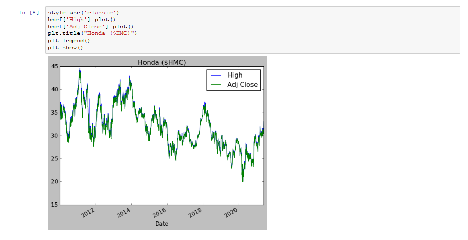

# 

##  WEEK 1 - GUESTBOOK
#### Please sign in with your name and a timestamp
1. Alexander Boehm 5/19/21 12:51 AM
2. Mitchell Mujwit 5/19/21 5:50PM
3. Rachel Hester 5/19/21 5:49PM
4. Phil Bowman 5/19/21 7:33
5. Bryan Humphries 5/20/21 11:40AM
6. Justin Davis 5/20/21 11:51AM
7. Andrew Vargas 5/20/21 12:13PM

-----------------------------------------------------------------------------

## WEEK 2 

### <u>TODO</u>
1. Install Python
2. Verify install
3. Prepare sa17d repo
4. tip_calc
5. screenshot installs
6. push
7. tested new workflow

### Delivs

1. *Screenshot of calc (IDLE)*:

2. *Screenshot of calc (VSC)*:

3.  *Filepath to .ipynmb file*: [here.](week2/tip_calculator.ipynb "notebookFP")

--------------------------------------------------------------------------------

## Week 3

### <u>TODO</u>
1. Work with your team.
2. Backwards engineer screenshot below.
3. If errors, check missing installs.
4. If needed, research how to do any installs
5. Include at *least* three graphs for each company
6. Create a different * style of graphs  for each company shown below
7. (To be done post deadline, optional) Fix main README, defer content to weekly repositories.

### Delivs

1. *Screenshots of Jupyter Notebook*:

2.  *Filepath to .ipynmb file*: [here.](week3/ticker.ipynb "notebookFP")