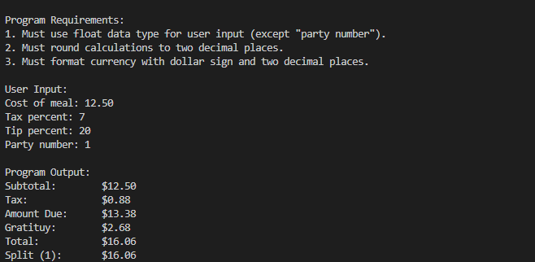

# 

## WEEK 2 

### <u>TODO</u>
1. Install Python
2. Verify install
3. Prepare sa17d repo
4. tip_calc
5. screenshot installs
6. push
7. tested new workflow

### Delivs

1. *Screenshot of calc (IDLE)*:

2. *Screenshot of calc (VSC)*:

3.  *Filepath to .ipynmb file*: [here.](week2/tip_calculator.ipynb "notebookFP")