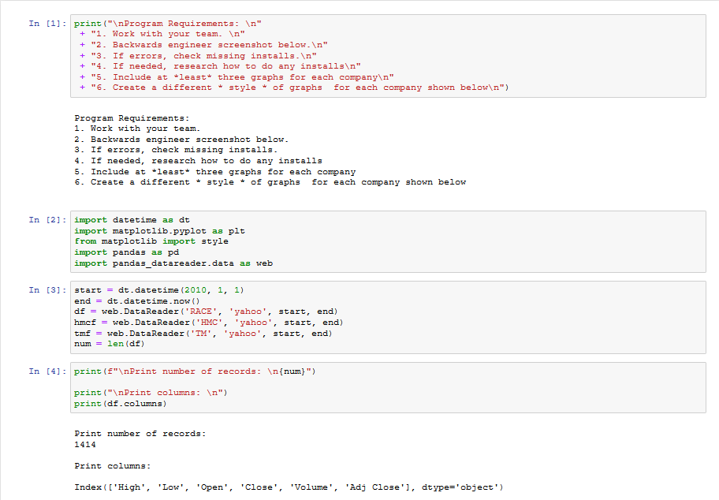
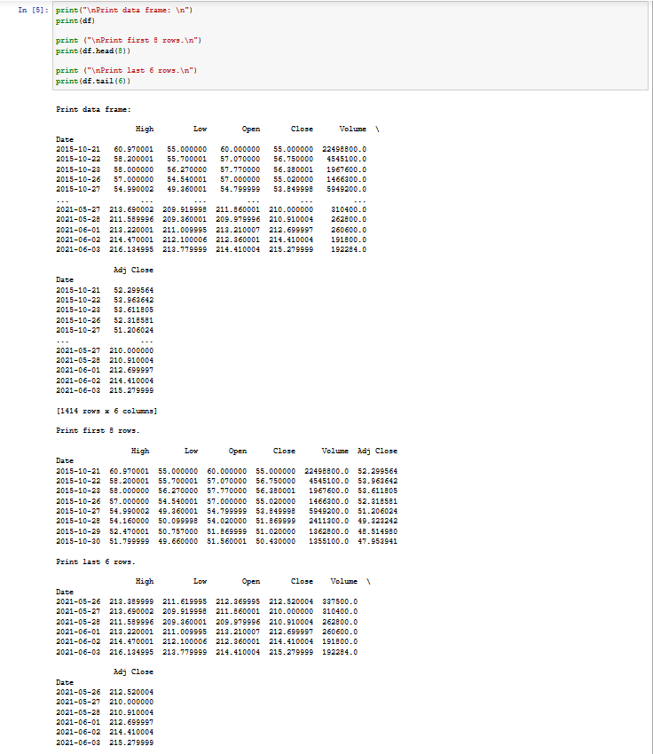
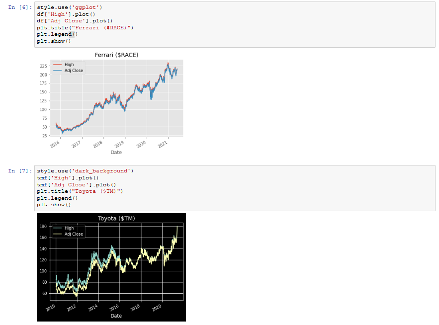
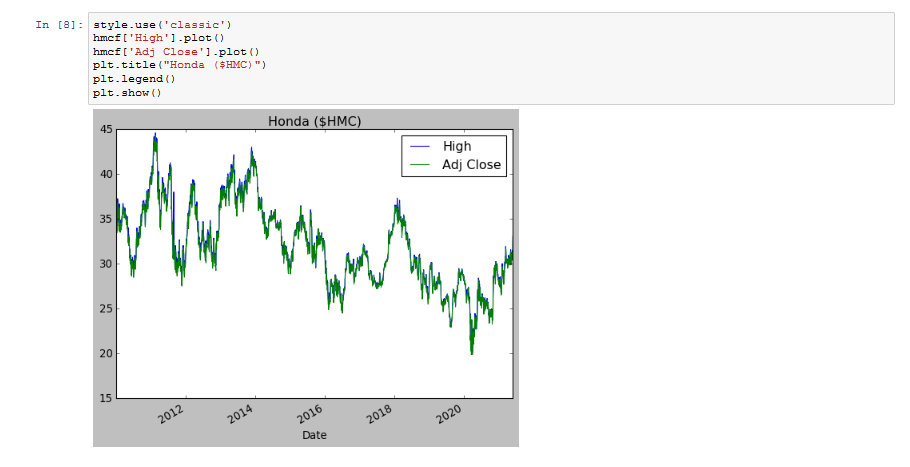

# 

## Week 3

### <u>TODO</u>
1. Work with your team.
2. Backwards engineer screenshot below.
3. If errors, check missing installs.
4. If needed, research how to do any installs
5. Include at *least* three graphs for each company
6. Create a different * style of graphs  for each company shown below
7. (To be done post deadline, optional) Fix main README, defer content to weekly repositories.

### Delivs

1. *Screenshots of Jupyter Notebook*:

2.  *Filepath to .ipynmb file*: [here.](week3/ticker.ipynb "notebookFP")