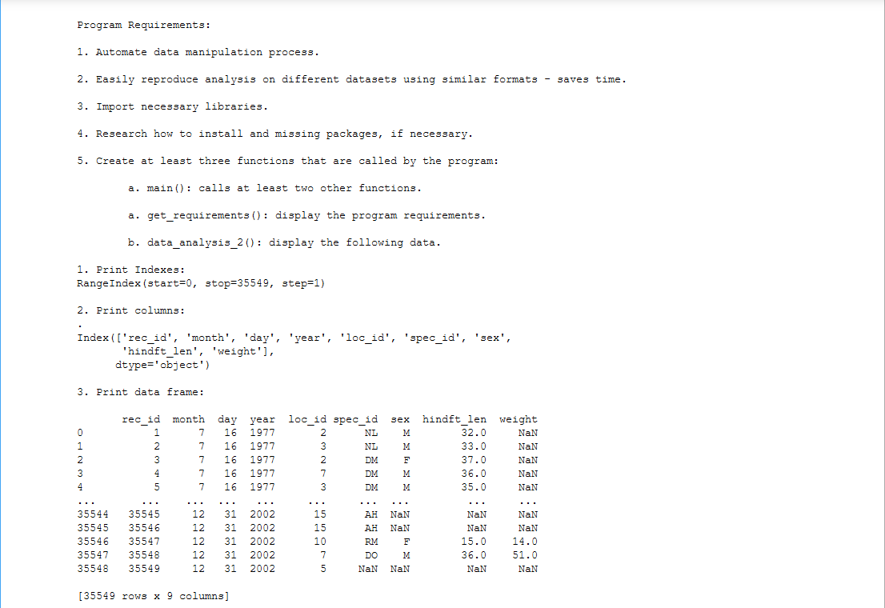
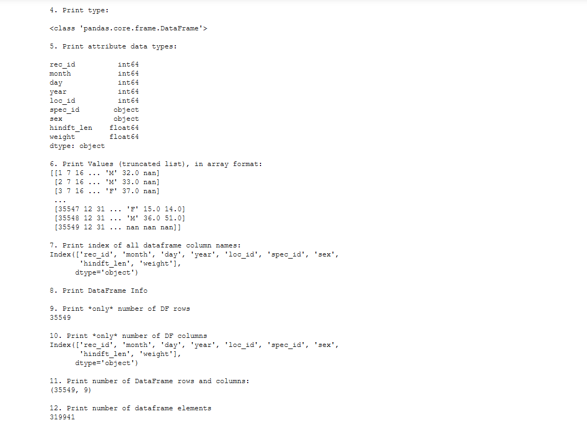
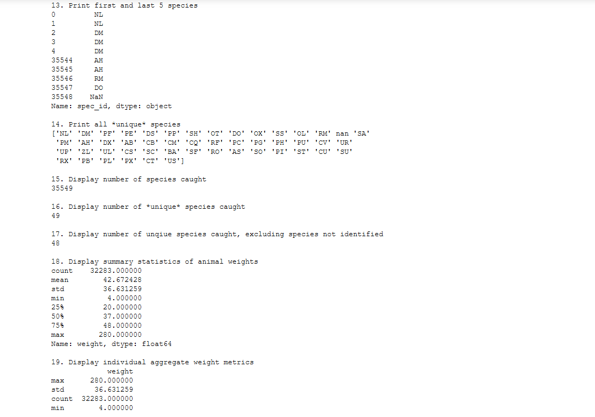
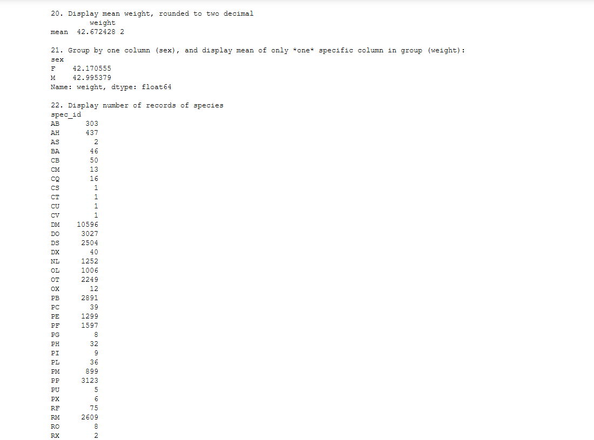
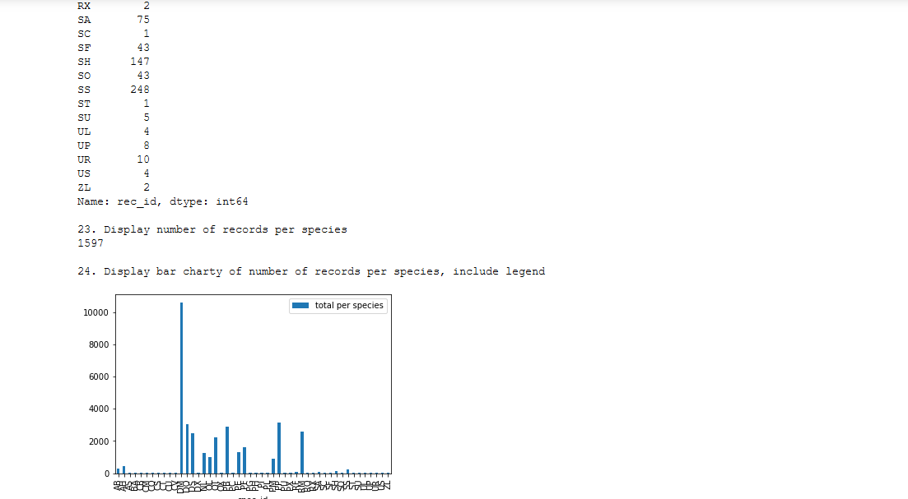
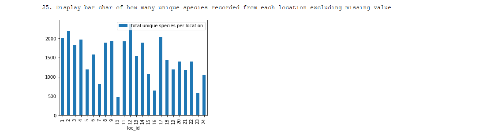

# 

## WEEK 4 

### <u>TODO</u>
- Chs. 11-15 in Python textbook.
- Backward-engineer screenshot below: README.md file should include the following items:
     
### Delivs
1. Screenshot of your Jupyter notebook (see below);
2. Upload .ipynb file and create link in README.md;
    - *Note: Before uploading .ipynb file, be sure to do the following actions from Kernal menu:*
    - Restart & Clear Output
    - Restart & Run All

2.  *Filepath to .ipynmb file*: [here.](week4/animalSurvey.ipynb "notebookFP")