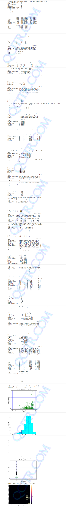

[Home](../README.md "Home") * [Week1](../week1/README.md "Week1") * [Week2](../week2/README.md "Week2") * [Week3](../week3/README.md "Week3")
* [Week4](../week4/README.md "Week4") * [Week5](../week5/README.md "Week5") * [Week6](../week6/README.md "Week6") 
* [Week7](../week7/README.md "Week7") * [Week8](../week8/README.md "Week8") * [Week9](../week9/README.md "Week9") 
* [Week10](../week10/README.md "Week10") * [Week11](../week11/README.md "Week11") * [Week12](../week12/README.md "Week12")

# LIS4905 Directed Independent Study

## Mark K. Jowett, Ph.D.

### Week 9 Requirements:

1. **Backward-engineer screenshot below:** README.md file should include the following items:
    1. **Screenshot of your Jupyter notebook (see below);**
    2. Upload .ipynb file and create link in README.md;  
    **Note:** *Before* uploading .ipynb file, *be sure* to do the following actions from **Kernal** menu:  
        a. **Restart & Clear Output**  
        b. **Restart & Run All**  
    
    **Note:** **Always** run the .py files *before* trying to create a Jupyter notebook using the code from the .py files. If the .py files won't run, neither will the notebook!  

[imdb-movie-data.csv](../resources/imdb-movie-data.csv "IMDB Data") ([Acknowledgement](https://www.imdb.com/interfaces/ "Acknowledgement"))  
 

2. [Week10 Requirements](../week10/README.md "Week10")

